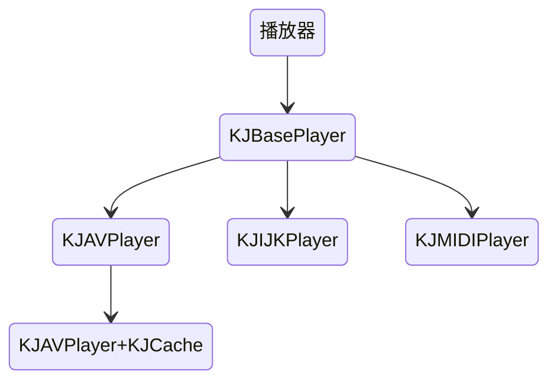
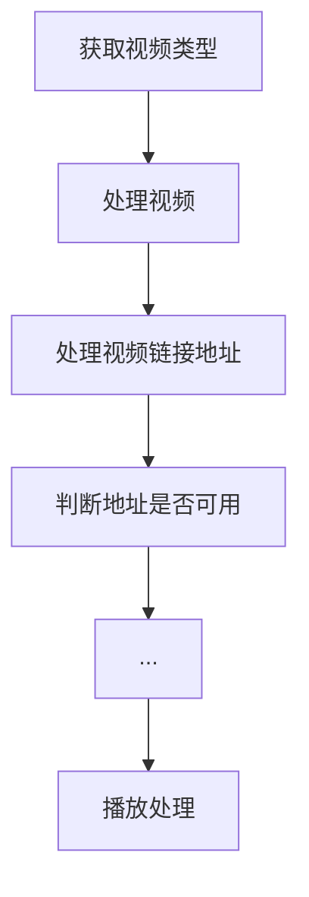

## 一、项目简介：
**最近利用闲暇时间来重构一下之前的播放器，这次的主要升级功能如下：**

* 支持动态切换内核
* 支持音/视频播放，midi文件播放  
* 支持在线播放/本地播放
* 支持后台播放，音频提取播放  
* 支持视频边下边播，分片下载播放存储
* 支持断点续载续播，下次直接优先从缓冲读取播放
* 支持缓存管理，清除时间段缓存
* 支持试看，自动跳过片头
* 支持记录上次播放时间
* 支持自动播放，自动连续播放
* 支持随机/重复/顺序播放
* 支持重力感应，全屏/半屏切换
* 支持基本手势操作，进度音量等
* 支持切换不同分辨率视频  
* 支持直播流媒体播放  

----------------------------------------
> 视频支持格式：mp4、m3u8、wav、avi  
> 音频支持格式：midi、mp3、

----------------------------------------

## 二、项目背景：
|  |  |
| --- | --- |

在很早之前写个一个播放器架子，但是这个架子只是当初简单的实现播放处理，那么这段时间事情不多，所以就利用闲暇时间来升级重构一下，其实网上关于播放器的轮子也非常多
[ZFPlayer](https://github.com/renzifeng/ZFPlayer)、[KRVideoPlayer](https://github.com/36Kr-Mobile/KRVideoPlayer)、[SJVideoPlayer](https://github.com/changsanjiang/SJBaseVideoPlayer)

这些轮子都很优秀，所以在制作的时候有借鉴参考  
然后慢慢完善实现一款可以高度自定义并且支持动态切换内核的播放器壳子，支持边下边播边存，续播续传功能，基本手势播放等等功能  
至于流媒体暂时网上也没发现有什么可以实现边下边播边存的方案，我其实这里有这样一个思路，可以利用搭建本地服务器来处理，先将分片数据下载到本地，然后播放这样也就只需要用户一次网络数据下载，等空闲时间我再来慢慢实现  
目前已初步实现KJAVPlyaer、KJIJKPlayer、KJMIDIPlayer三种内核，



- KJAVPlyaer基于AVPlayer封装使用
- KJIJKPlayer基于b站IJKMediaFramework封装使用
- KJMIDIPlayer基于AudioToolBox封装使用

## 三、实践过程：

技术选型：项目目前主要还是基于AVPlayer的灵活封装使用，然后也有对Bilibili开源IJKMediaFramework的使用处理  
基于AVPlayer实现边下边播边存功能，目前很多网上资料基本都是基于唱吧[KTVHTTPCache](https://github.com/ChangbaDevs/KTVHTTPCache)来实现，而本文则是采用`NSURLSession`封装的下载器，在结合文件写入`NSFileHandle`来实现，然后将信息存储在数据库  

## 四、模块介绍
主要就是分为以下几大模块，
### KJBaseFunctionPlayer播放器协议
所有播放器壳子都是基于该基础做处理，提取公共部分

|   API & Property   |  类型  |  功能  | 
| ---- | :----: | ---- |
| delegate | Property | 委托代理 |
| requestHeader | Property | 视频请求头 |
| roregroundResume | Property | 返回前台继续播放 |
| backgroundPause | Property | 进入后台暂停播放 |
| autoPlay | Property | 是否开启自动播放 |
| speed | Property | 播放速度 |
| volume | Property | 播放音量 |
| cacheTime | Property | 缓存达到多少秒才能播放 |
| skipHeadTime | Property | 跳过片头 |
| timeSpace | Property | 时间刻度 |
| kVideoTotalTime | Property | 获取视频总时长 |
| kVideoURLFromat | Property | 获取视频格式 |
| kVideoTryLookTime | Property | 免费试看时间和试看结束回调 |
| videoURL | Property | 视频地址 |
| localityData | Property | 是否为本地资源 |
| isPlaying | Property | 是否正在播放 |
| currentTime | Property | 当前播放时间 |
| ecode | Property | 播放失败 |
| kVideoAdvanceAndReverse | Property | 快进或快退 |
| shared | Property | 单例属性 |
| kj_sharedInstance | Instance | 创建单例 |
| kj_attempDealloc | Instance | 销毁单例 |
| kj_play | Instance | 准备播放 |
| kj_replay | Instance | 重播 |
| kj_resume | Instance | 继续 |
| kj_pause | Instance | 暂停 |
| kj_stop | Instance | 停止 |

#### KJPlayerDelegate委托代理
```
/* 当前播放器状态 */
- (void)kj_player:(KJBasePlayer*)player state:(KJPlayerState)state;
/* 播放进度 */
- (void)kj_player:(KJBasePlayer*)player currentTime:(NSTimeInterval)time;
/* 缓存进度 */
- (void)kj_player:(KJBasePlayer*)player loadProgress:(CGFloat)progress;
/* 播放错误 */
- (void)kj_player:(KJBasePlayer*)player playFailed:(NSError*)failed;
```

### KJBaseUIPlayer播放器协议
播放器UI相关协议

|   API & Property   |  类型  |  功能  | 
| ---- | :----: | ---- |
| playerView | Property | 播放器载体 |
| background | Property | 背景颜色 |
| placeholder | Property | 占位图 |
| videoGravity | Property | 视频显示模式 |
| kVideoSize | Property | 获取视频尺寸大小 |
| kVideoTimeScreenshots | Property | 获取当前截屏 |
| kVideoPlaceholderImage | Property | 子线程获取封面图，图片会存储在磁盘 |
| kj_startAnimation | Instance | 圆圈加载动画 |
| kj_stopAnimation | Instance | 停止动画 |
| kj_displayHintText: | Instance | 支持富文本提示的文本框，零秒表示不自动消失 |
| kj_displayHintText:time:max:position: | Instance | 支持富文本提示的文本框，零秒表示不自动消失 |
| kj_hideHintText | Instance | 隐藏提示文字 |


### KJBasePlayerView播放器视图基类，播放器控件父类
只要子控件没有涉及到手势交互，我均采用Layer的方式来处理，然后根据`zPosition`来区分控件的上下层级关系

```
/* 控件位置和大小发生改变信息通知 */
extern NSString *kPlayerBaseViewChangeNotification;
/* 控件位置和大小发生改变key */
extern NSString *kPlayerBaseViewChangeKey;
@protocol KJPlayerBaseViewDelegate;
@interface KJBasePlayerView : UIImageView
/* 委托代理 */
@property (nonatomic,weak) id <KJPlayerBaseViewDelegate> delegate;
/* 主色调，默认白色 */
@property (nonatomic,strong) UIColor *mainColor;
/* 副色调，默认红色 */
@property (nonatomic,strong) UIColor *viceColor;
/* 支持手势，支持多枚举 */
@property (nonatomic,assign) KJPlayerGestureType gestureType;
/* 长按执行时间，默认1秒 */
@property (nonatomic,assign) NSTimeInterval longPressTime;
/* 操作面板自动隐藏时间，默认2秒然后为零表示不隐藏 */
@property (nonatomic,assign) NSTimeInterval autoHideTime;
/* 操作面板高度，默认60px */
@property (nonatomic,assign) CGFloat operationViewHeight;
/* 当前操作面板状态 */
@property (nonatomic,assign,readonly) BOOL displayOperation;
/* 隐藏操作面板时是否隐藏返回按钮，默认yes */
@property (nonatomic,assign) BOOL isHiddenBackButton;
/* 小屏状态下是否显示返回按钮，默认yes */
@property (nonatomic,assign) BOOL smallScreenHiddenBackButton;
/* 全屏状态下是否显示返回按钮，默认no */
@property (nonatomic,assign) BOOL fullScreenHiddenBackButton;
/* 是否开启自动旋转，默认yes */
@property (nonatomic,assign) BOOL autoRotate;
/* 是否为全屏，名字别乱改后面kvc有使用 */
@property (nonatomic,assign) BOOL isFullScreen;
/* 当前屏幕状态，名字别乱改后面kvc有使用 */
@property (nonatomic,assign,readonly) KJPlayerVideoScreenState screenState;
/* 当前屏幕状态发生改变 */
@property (nonatomic,copy,readwrite) void (^kVideoChangeScreenState)(KJPlayerVideoScreenState state);
/* 返回回调 */
@property (nonatomic,copy,readwrite) void (^kVideoClickButtonBack)(KJBasePlayerView *view);
/* 提示文字面板属性，默认最大宽度250px */
@property (nonatomic,copy,readonly) void (^kVideoHintTextInfo)(void(^)(KJPlayerHintInfo *info));

#pragma mark - 控件
/* 快进快退进度控件 */
@property (nonatomic,strong) KJPlayerFastLayer *fastLayer;
/* 音量亮度控件 */
@property (nonatomic,strong) KJPlayerSystemLayer *vbLayer;
/* 加载动画层 */
@property (nonatomic,strong) KJPlayerLoadingLayer *loadingLayer;
/* 文本提示框 */
@property (nonatomic,strong) KJPlayerHintTextLayer *hintTextLayer;
/* 顶部操作面板 */
@property (nonatomic,strong) KJPlayerOperationView *topView;
/* 底部操作面板 */
@property (nonatomic,strong) KJPlayerOperationView *bottomView;
/* 返回按钮 */
@property (nonatomic,strong) KJPlayerButton *backButton;
/* 锁屏按钮 */
@property (nonatomic,strong) KJPlayerButton *lockButton;
/* 播放按钮 */
@property (nonatomic,strong) KJPlayerButton *centerPlayButton;

#pragma mark - method
/* 隐藏操作面板，是否隐藏返回按钮 */
- (void)kj_hiddenOperationView;
/* 显示操作面板 */
- (void)kj_displayOperationView;
/* 取消收起操作面板，可用于滑动滑杆时刻不自动隐藏 */
- (void)kj_cancelHiddenOperationView;
```
#### KJPlayerBaseViewDelegate控件载体协议
控件相关委托代理

```
/* 单双击手势反馈 */
- (void)kj_basePlayerView:(KJBasePlayerView*)view isSingleTap:(BOOL)tap;
/* 长按手势反馈 */
- (void)kj_basePlayerView:(KJBasePlayerView*)view longPress:(UILongPressGestureRecognizer*)longPress;
/* 进度手势反馈，不替换UI请返回当前时间和总时间，范围-1 ～ 1 */
- (NSArray*)kj_basePlayerView:(KJBasePlayerView*)view progress:(float)progress end:(BOOL)end;
/* 音量手势反馈，是否替换自带UI，范围0 ～ 1 */
- (BOOL)kj_basePlayerView:(KJBasePlayerView*)view volumeValue:(float)value;
/* 亮度手势反馈，是否替换自带UI，范围0 ～ 1 */
- (BOOL)kj_basePlayerView:(KJBasePlayerView*)view brightnessValue:(float)value;
/* 是否锁屏，根据KJPlayerButton的type来确定当前按钮类型 */
- (void)kj_basePlayerView:(KJBasePlayerView*)view PlayerButton:(KJPlayerButton*)button;
```

### KJPlayerType
枚举文件夹和公共方法管理

- KJPlayerState：播放器状态
- KJPlayerCustomCode：错误code
- KJPlayerGestureType：手势操作
- KJPlayerPlayType：播放类型
- KJPlayerDeviceDirection：手机方向
- KJPlayerVideoGravity：播放器充满类型
- KJPlayerVideoFromat：视频格式

### DBPlayerDataInfo
主要包括两部分，数据库模型和增删改查等工具    
**数据库结构**


```
dbid：唯一id，视频链接去除scheme然后md5
videoUrl：视频链接  
saveTime：存储时间戳
sandboxPath：沙盒地址
videoFormat：视频格式
videoTime：视频时间
videoData：视频数据
```
**数据库工具**

|  方法  |  功能  | 
| ---- | ---- |
| kj_insertData:Data: | 插入数据，重复数据替换处理 |
| kj_deleteData: | 删除数据 |
| kj_addData: | 新添加数据 |
| kj_updateData:Data: | 更新数据 |
| kj_checkData: | 查询数据，传空传全部数据 |
| kCheckAppointDatas | 指定条件查询 |

### KJResourceLoader
中间桥梁作用，把网络请求缓存到本地的临时数据传递给播放器  
关于这块的详细介绍，我单独写了一篇 **[开发播放器框架之边下边播边存方案分享](https://juejin.cn/post/6933484618398203911)**

### KJPlayer - AVPlayer播放器内核
工作流程：


1、获取视频类型，根据网址来确定，目前没找到更好的方式（知道的朋友可以指点一下）

```
/// 根据链接获取Asset类型
NS_INLINE KJPlayerAssetType kPlayerVideoAesstType(NSURL *url){
    if (url == nil) return KJPlayerAssetTypeNONE;
    if (url.pathExtension.length) {
        if ([url.pathExtension containsString:@"m3u8"] || [url.pathExtension containsString:@"ts"]) {
            return KJPlayerAssetTypeHLS;
        }
    }
    NSArray * array = [url.path componentsSeparatedByString:@"."];
    if (array.count == 0) {
        return KJPlayerAssetTypeNONE;
    }else{
        if ([array.lastObject containsString:@"m3u8"] || [array.lastObject containsString:@"ts"]) {
            return KJPlayerAssetTypeHLS;
        }
    }
    return KJPlayerAssetTypeFILE;
}
```

2、处理视频，这里才用队列组来处理，子线程处理解决第一次加载卡顿问题

```
dispatch_group_async(group, dispatch_get_global_queue(DISPATCH_QUEUE_PRIORITY_DEFAULT, 0), ^{
    if ([weakself kj_dealVideoURL:&tempURL]) {
        if (![tempURL.absoluteString isEqualToString:self->_videoURL.absoluteString]) {
            self->_videoURL = tempURL;
            [weakself kj_initPreparePlayer];
        }else{
            [weakself kj_playerReplay];
        }
    }
});
```

3、处理视频链接地址，这里分两种情况，使用缓存就从缓存当中读取

```
/* 判断当前资源文件是否有缓存，修改为指定链接地址 */
- (void)kj_judgeHaveCacheWithVideoURL:(NSURL * _Nonnull __strong * _Nonnull)videoURL{
    self.locality = NO;
    KJCacheManager.kJudgeHaveCacheURL(^(BOOL locality) {
        self.locality = locality;
        if (locality) {
            self.playError = [DBPlayerDataInfo kj_errorSummarizing:KJPlayerCustomCodeCachedComplete];
        }
    }, videoURL);
}
```
获取数据库当中的数据

```
/* 判断是否有缓存，返回缓存链接 */
+ (void(^)(void(^)(BOOL),NSURL * _Nonnull __strong * _Nonnull))kJudgeHaveCacheURL{
    return ^(void(^locality)(BOOL),NSURL * _Nonnull __strong * _Nonnull videoURL){
        NSArray<DBPlayerData*>*temps = [DBPlayerDataInfo kj_checkData:kPlayerIntactName(*videoURL)];
        BOOL boo = NO;
        if (temps.count) {
            DBPlayerData *data = temps.firstObject;
            NSString *path = data.sandboxPath;
            if (data.videoIntact && [KJCacheManager kj_haveFileSandboxPath:&path]) {
                //移出之前的临时文件
                NSString *tempPath = [path stringByAppendingPathExtension:kTempReadName];
                [[NSFileManager defaultManager] removeItemAtPath:tempPath error:NULL];
                *videoURL = [NSURL fileURLWithPath:path];
                boo = YES;
            }
        }
        kGCD_player_main(^{
            if (locality) locality(boo);
        });
    };
}
```
4、判断地址是否可用，添加下载和播放桥梁

```
PLAYER_WEAKSELF;
if (!kPlayerHaveTracks(*videoURL, ^(AVURLAsset * asset) {
    if (weakself.useCacheFunction && !weakself.localityData) {
        weakself.state = KJPlayerStateBuffering;
        weakself.loadState = KJPlayerLoadStateNone;
        NSURL * tempURL = weakself.connection.kj_createSchemeURL(*videoURL);
        weakself.asset = [AVURLAsset URLAssetWithURL:tempURL options:weakself.requestHeader];
        [weakself.asset.resourceLoader setDelegate:weakself.connection queue:dispatch_get_main_queue()];
    }else{
        weakself.asset = asset;
    }
}, self.requestHeader)) {
    self.ecode = KJPlayerCustomCodeVideoURLFault;
    self.state = KJPlayerStateFailed;
    [self kj_destroyPlayer];
    return NO;
}
```

5、播放准备操作设置`playerItem`，然后初始化`player`，添加时间观察者处理播放

```
self.timeObserver = [self.player addPeriodicTimeObserverForInterval:CMTimeMakeWithSeconds(_timeSpace, NSEC_PER_SEC) queue:dispatch_queue_create("kj.player.time.queue", NULL) usingBlock:^(CMTime time) {
    NSTimeInterval sec = CMTimeGetSeconds(time);
    if (isnan(sec) || sec < 0) sec = 0;
    if (weakself.totalTime <= 0) return;
    if ((NSInteger)sec >= (NSInteger)weakself.totalTime) {
        [weakself.player pause];
        weakself.state = KJPlayerStatePlayFinished;
        weakself.currentTime = 0;
    }else if (weakself.userPause == NO && weakself.buffered) {
        weakself.state = KJPlayerStatePlaying;
        weakself.currentTime = sec;
    }
    if (sec > weakself.tryTime && weakself.tryTime) {
        [weakself kj_pause];
        if (!weakself.tryLooked) {
            weakself.tryLooked = YES;
            kGCD_player_main(^{
                if (weakself.tryTimeBlock) weakself.tryTimeBlock();
            });
        }
    }else{
        weakself.tryLooked = NO;
    }
}];
```

6、处理视频状态，kvo监听播放器五种状态 
 
- `status`：监听播放器状态 
- `loadedTimeRanges`：监听播放器缓冲进度 
- `presentationSize`：监听视频尺寸  
- `playbackBufferEmpty`：监听缓存不够的情况
- `playbackLikelyToKeepUp`：监听缓存足够  

大致流程就差不多这样子，Demo也写的很详细，可以自己去看看


## 五、总结思考：
在重构播放器的时候，其中遇见不少细节上面的问题，现在应该还是存在不少的问题，也希望朋友们指出，然后我好慢慢修改完善。  
我Demo写的很详细，感兴趣的老哥可以去下载来玩玩
### Demo地址
Demo地址：[KJPlayerDemo](https://github.com/yangKJ/KJPlayerDemo)

## 六、文章关联
### 关于播放器其他相关文章
- **[开发播放器框架之全屏处理](https://juejin.cn/post/6933484150347284488)**
- **[开发播放器框架之边下边播边存方案分享](https://juejin.cn/post/6933484618398203911)**

### 播放器轮子制造回顾，老哥觉得好用还请帮我点个**[小星星](https://github.com/yangKJ/KJPlayerDemo)**传送门

